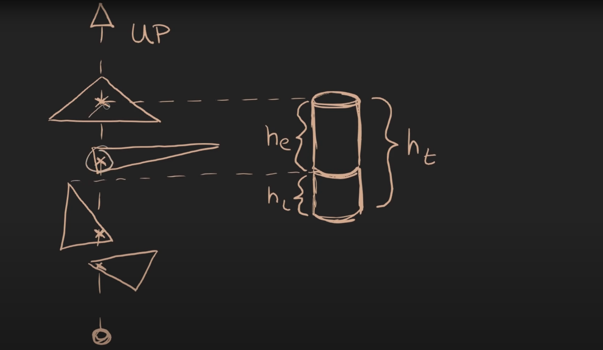
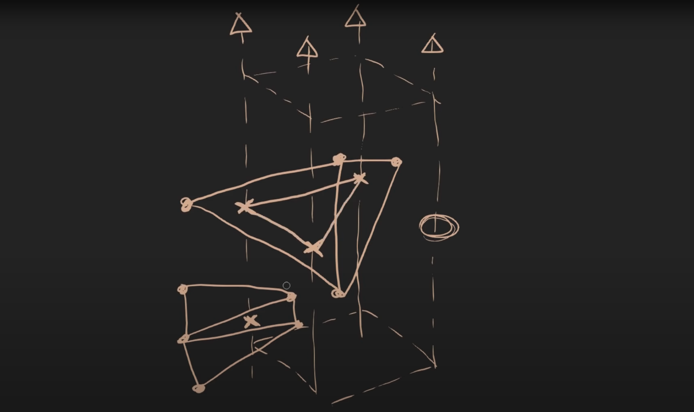
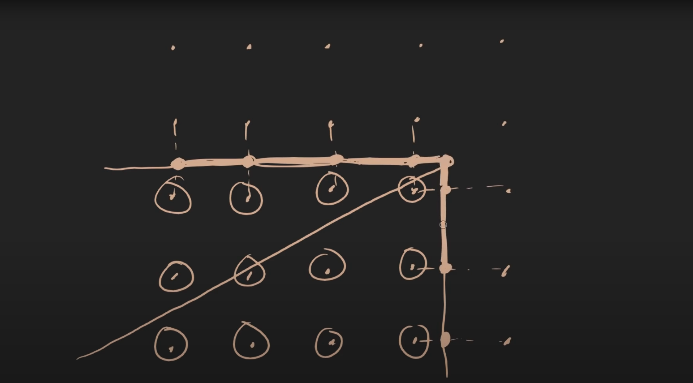
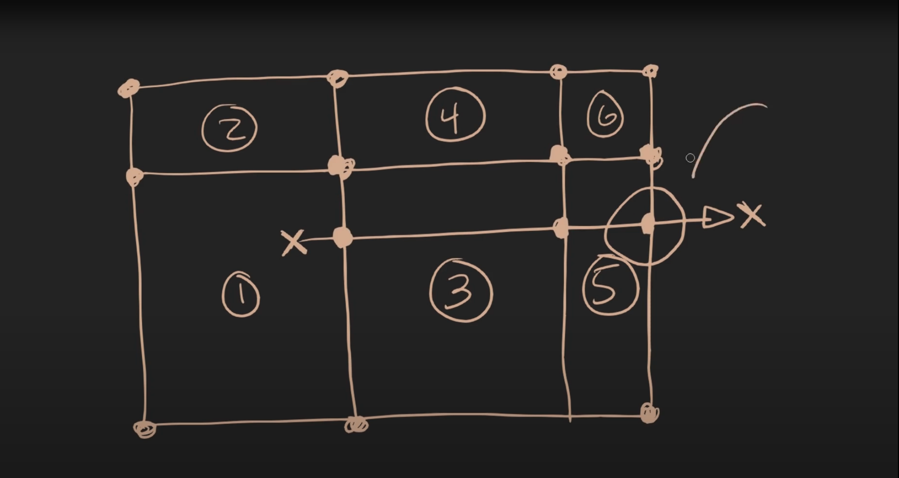
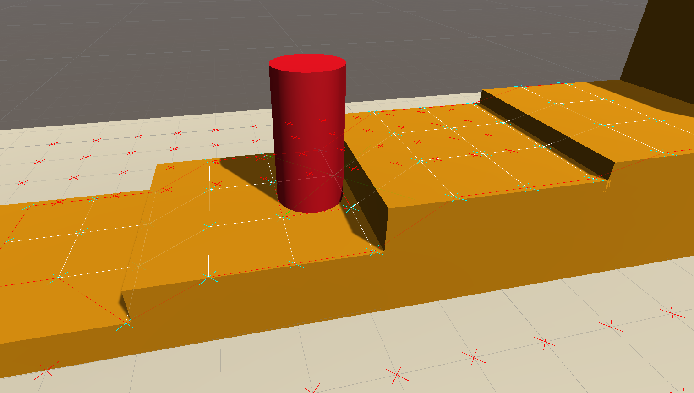
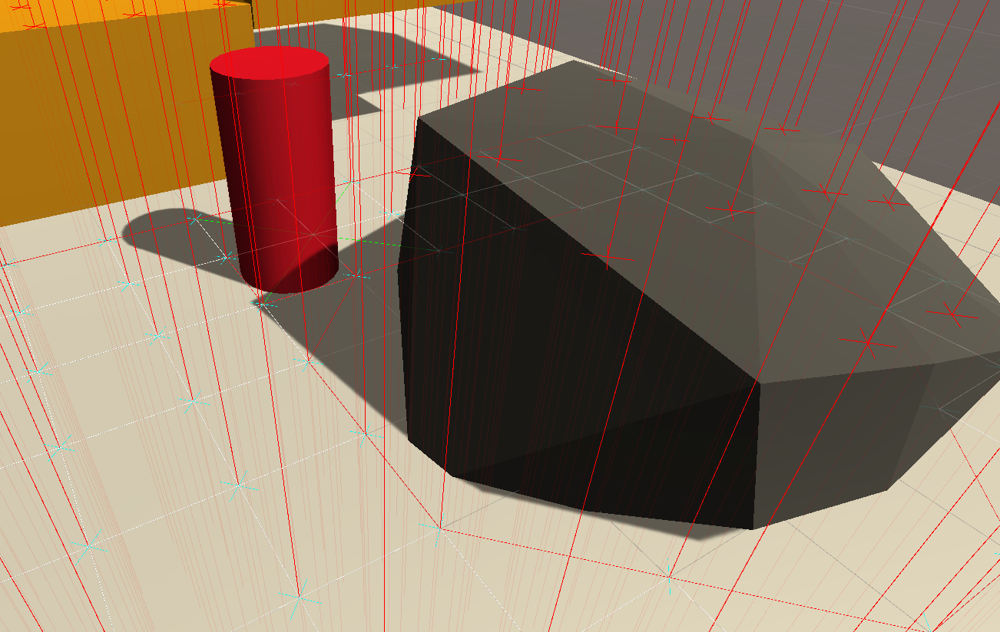

# Mesh based navigation

## problem

The physics bases movement system used in most games is unpredictable and unreliable.
This movement system aims to change that, improving the experience for devs and players.
The basic consept is to create a grid aground the player that matches the walkable geometry and then allow the player to walk along that

## steps
1. poll geometry
2. select hits
3. find edges
4. build rings
5. project movement

## poll geometry

We start by casting rays straight down. As the ray progresses we record any intersections with world geometry.
The result is an array of hits, sorted highest to lowest.

## select hits

From these geometry hits we must select the walkable surface. We try to find the highest point that the player can walk on. 
The player has two measurements that we use to eliminate hits, leg height (hl) and effective height (he). The leg height determines how much the player can step up or down (for slopes, stairs, etc..). The effective hight determines where the player will hit their head.
Using these we can eliminate any points that are too high, too low or do not contain enough room for the player. 

Diagram 0.

## find edges

To find the edges of where the player can walk. We have to mark all the points that are next to points without a valid hit. 

Diagram 1.

## build rings

From the grid of points we have to build the actual geometry we will move the player along. This involves grouping the points and stringing together the nodes from highest to lowest.

Diagram 2.

## project movement

Now that we have a surface the player can walk on we have to move the player along it. To do this we project the desired movement direction along the rings we created, searching in nearby rings for an intersections with the desired ray. When we reach an edge or the maximum desired distance, that is the point the player moves to. 

Diagram 3.

## visualization 

Because of the design of the system, we can build tools that will show exactly what the player will walk on, allowing developers to craft level geometry with confidence. 

## Sources

Killing the Walk Monster - https://www.youtube.com/watch?v=YE8MVNMzpbo
Walk Monster - https://caseymuratori.com/blog_0005
Flood-fill Algorithm - https://www.hackerearth.com/practice/algorithms/graphs/flood-fill-algorithm/tutorial/
